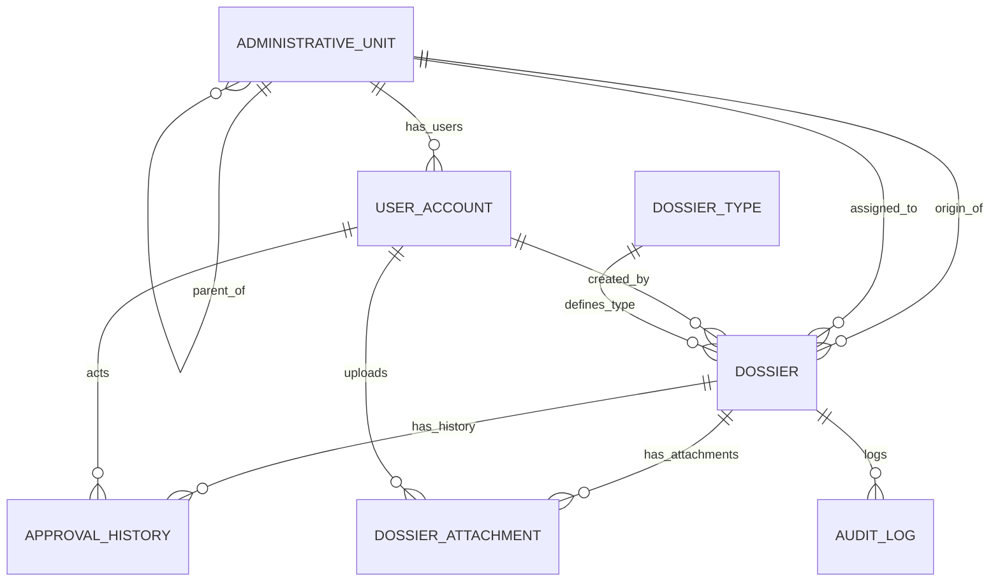

## 02 — Database (MySQL) & Schema

Backend Java dùng **MySQL** với **Spring Data JPA** và **Flyway** để quản lý schema.
Các entity chính chạy trong `backend-java/src/main/java/com/landmanagement/entity`, còn migration file nằm trong `backend-java/src/main/resources/db/migration`.

### Tổng quan schema

Các bảng chính hiện tại:

- `administrative_unit`
- `user_account`
- `dossier_type`
- `dossier`
- `approval_history`
- `dossier_attachment`
- `audit_log`

### Bảng `administrative_unit`

Mục đích: mô hình hóa cấu trúc hành chính **CENTRAL → PROVINCE → COMMUNE**.

Columns:

- `id` (PK, bigint)
- `name` (varchar, NOT NULL)
- `unit_level` (enum string, NOT NULL) — `CENTRAL | PROVINCE | COMMUNE`
- `unit_kind` (enum string, NULLABLE) — `COMMUNE | WARD`
- `parent_id` (bigint, NULLABLE) — self-reference cho cây đơn vị
- `is_active` (boolean, NOT NULL, default TRUE)
- `created_at` (datetime, NOT NULL)
- `updated_at` (datetime, NOT NULL)

Các property quan trọng:

- `parent_id` giữ quan hệ cha-con giữa đơn vị.
- `unit_kind` chỉ dùng cho đơn vị cấp xã/phường.
- Các timestamp `created_at` / `updated_at` được gán tự động bởi JPA lifecycle callback.

### Bảng `user_account`

Mục đích: người dùng hệ thống, kết nối với đơn vị hành chính.

Columns:

- `id` (PK, bigint)
- `username` (varchar, NOT NULL, UNIQUE)
- `password_hash` (varchar, NOT NULL)
- `full_name` (varchar, NOT NULL)
- `email` (varchar, NOT NULL, UNIQUE)
- `phone_number` (varchar, NULLABLE)
- `address` (varchar, NULLABLE)
- `role_code` (enum string, NOT NULL) — `ADMIN | COMMUNE_OFFICER | PROVINCE_OFFICER | CENTRAL_OFFICER`
- `unit_id` (bigint, NOT NULL) — FK tới `administrative_unit.id`
- `is_active` (boolean, NOT NULL, default TRUE)
- `is_first_login` (boolean, NOT NULL, default TRUE)
- `must_change_password` (boolean, NOT NULL, default FALSE)
- `password_changed_at` (datetime, NULLABLE)
- `password_expires_at` (datetime, NULLABLE)
- `last_login_at` (datetime, NULLABLE)
- `created_at` (datetime, NOT NULL)
- `updated_at` (datetime, NOT NULL)

Ghi chú nghiệp vụ:

- `COMMUNE_OFFICER` thường liên kết với đơn vị `COMMUNE`.
- `PROVINCE_OFFICER` liên kết với đơn vị `PROVINCE`.
- `CENTRAL_OFFICER` liên kết với `CENTRAL`.
- `ADMIN` là quyền quản trị; seed mặc định có thể đặt ở đơn vị trung ương.

### Bảng `dossier_type`

Mục đích: định nghĩa loại hồ sơ.

Columns:

- `id` (PK, bigint)
- `code` (varchar, NOT NULL, UNIQUE)
- `name` (varchar, NOT NULL)
- `processing_days` (int, NOT NULL)
- `description` (varchar, NULLABLE)

### Bảng `dossier`

Mục đích: lưu trữ hồ sơ và trạng thái xử lý.

Columns:

- `id` (PK, bigint)
- `dossier_code` (varchar, NOT NULL, UNIQUE)
- `title` (varchar, NOT NULL)
- `citizen_name` (varchar, NOT NULL)
- `citizen_phone` (varchar, NULLABLE)
- `citizen_identity_number` (varchar, NULLABLE)
- `citizen_address` (varchar, NULLABLE)
- `dossier_type_id` (bigint, NOT NULL) — FK tới `dossier_type.id`
- `status_code` (enum string, NOT NULL) — `PENDING | APPROVED | RETURNED | ESCALATED`
- `sent_to_central` (boolean, NOT NULL, default FALSE)
- `origin_unit_id` (bigint, NOT NULL) — đơn vị tạo hồ sơ
- `assigned_to_unit_id` (bigint, NOT NULL) — đơn vị nhận xử lý tiếp theo
- `created_by_user_id` (bigint, NOT NULL)
- `priority` (enum string, NOT NULL, default NORMAL) — `NORMAL | URGENT | EMERGENCY`
- `current_step` (enum string, NOT NULL, default RECEIVE) — `RECEIVE | VERIFY | APPROVE | COMPLETE`
- `received_at` (datetime, NULLABLE)
- `due_date` (datetime, NULLABLE)
- `completed_at` (datetime, NULLABLE)
- `created_at` (datetime, NOT NULL)
- `updated_at` (datetime, NOT NULL)

Tác động nghiệp vụ:

- `dossier_code` được giữ unique để dễ tìm và audit.
- `assigned_to_unit_id` quyết định inbox đơn vị tiếp nhận.
- `sent_to_central` đánh dấu hồ sơ đã chuyển lên cấp trung ương.

### Bảng `approval_history`

Mục đích: ghi nhận từng hành động xử lý hồ sơ.

Columns:

- `id` (PK, bigint)
- `dossier_id` (bigint, NOT NULL)
- `actor_user_id` (bigint, NOT NULL)
- `actor_unit_id` (bigint, NOT NULL)
- `from_unit_id` (bigint, NULLABLE)
- `to_unit_id` (bigint, NULLABLE)
- `action_code` (enum string, NOT NULL) — `CREATE | APPROVE | RETURN | ESCALATE | SUBMIT | SEND_TO_CENTRAL`
- `note` (varchar, NULLABLE)
- `signature_base64_png` (varchar, NULLABLE)
- `created_at` (datetime, NOT NULL)

### Bảng `dossier_attachment`

Mục đích: lưu metadata file đính kèm hồ sơ.

Columns:

- `id` (PK, bigint)
- `dossier_id` (bigint, NOT NULL)
- `original_filename` (varchar, NOT NULL)
- `content_type` (varchar, NOT NULL)
- `storage_path` (varchar, NOT NULL)
- `file_size` (bigint, NULLABLE)
- `uploaded_by_user_id` (bigint, NOT NULL)
- `uploaded_at` (datetime, NOT NULL)

Ghi chú:

- File nhị phân không lưu trực tiếp trong DB.
- `storage_path` lưu đường dẫn vật lý hoặc UUID trên storage server.

### Bảng `audit_log`

Mục đích: theo dõi hành động quan trọng và sự kiện hệ thống.

Columns:

- `id` (PK, bigint)
- `user_id` (bigint, NULLABLE)
- `username` (varchar, NOT NULL)
- `action_type` (varchar, NOT NULL)
- `entity_type` (varchar, NOT NULL)
- `entity_id` (bigint, NULLABLE)
- `dossier_id` (bigint, NULLABLE)
- `old_value` (TEXT, NULLABLE)
- `new_value` (TEXT, NULLABLE)
- `ip_address` (varchar, NULLABLE)
- `user_agent` (TEXT, NULLABLE)
- `status` (varchar, NOT NULL)
- `error_message` (TEXT, NULLABLE)
- `description` (TEXT, NULLABLE)
- `created_at` (datetime, NOT NULL)

### Seed và dữ liệu mẫu

Hiện tại backend cung cấp seed dev để khởi tạo dữ liệu mẫu cho môi trường cục bộ.

- `seed-vn` tạo dữ liệu hành chính gần với cấu trúc VN: nhiều tỉnh và xã/phường.
- Seed mẫu cũng tạo người dùng, hồ sơ, lịch sử xử lý và file đính kèm demo.

### ERD (Mermaid)

