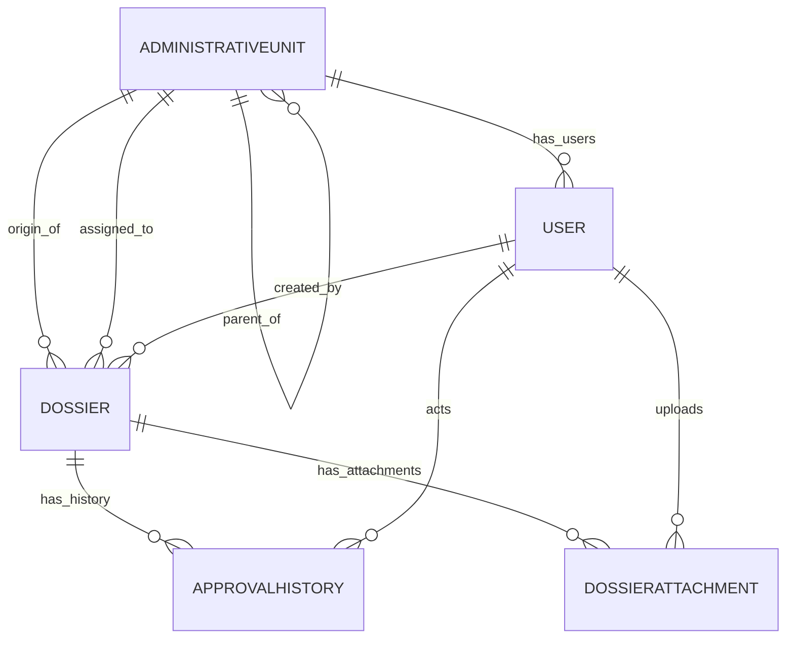
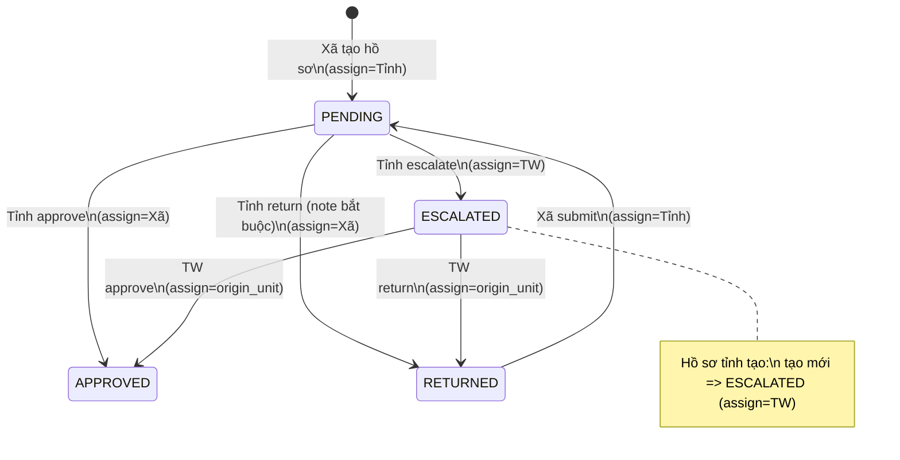
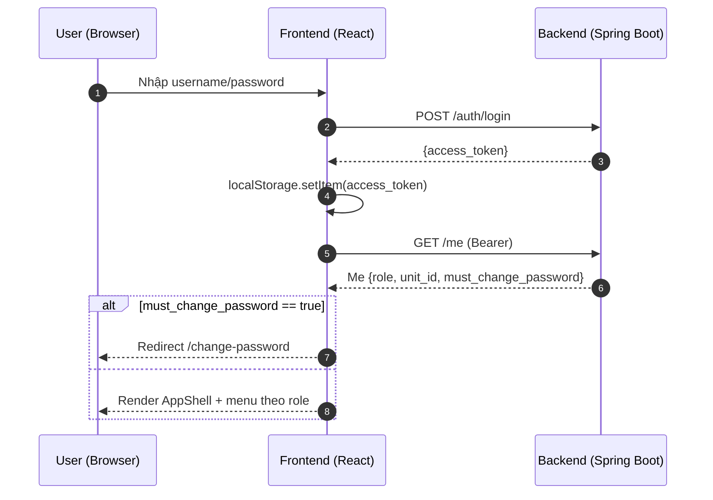
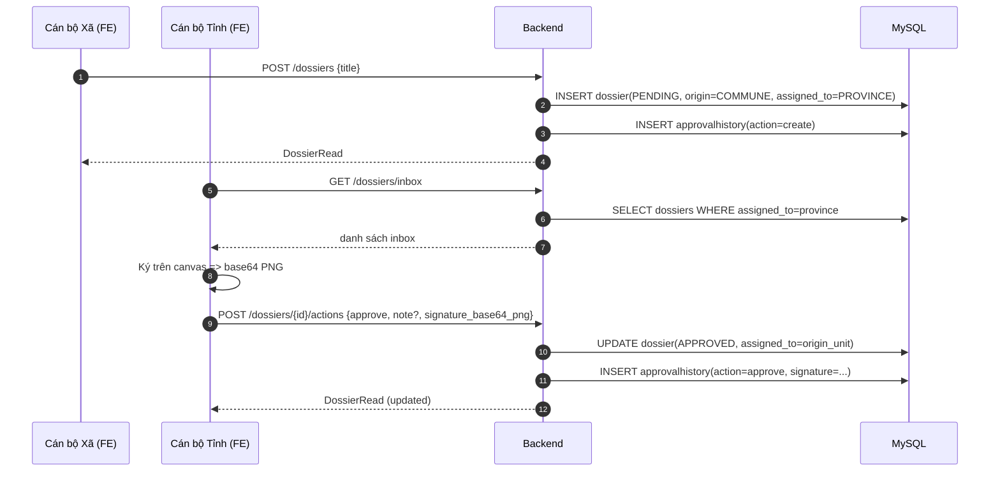
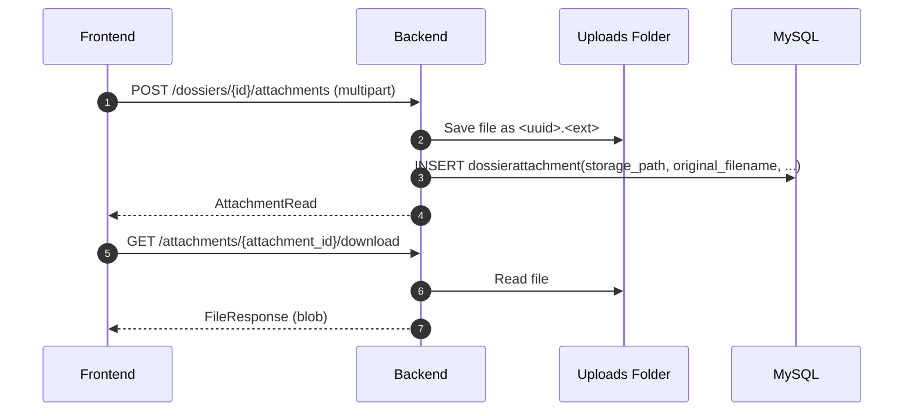
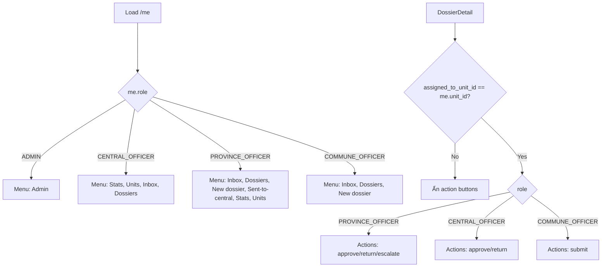

## 05 — Diagrams (Mermaid)

### 5.1 ERD (Entity Relationship Diagram)

---

### 5.2 State machine — trạng thái hồ sơ

---

### 5.3 Sequence — login + load profile + route guard

---

### 5.4 Sequence — Xã tạo hồ sơ → Tỉnh duyệt (kèm chữ ký)

---

### 5.5 Sequence — Upload & download tài liệu đính kèm

---

### 5.6 Flowchart — UI hiển thị theo role (menu + action buttons)

