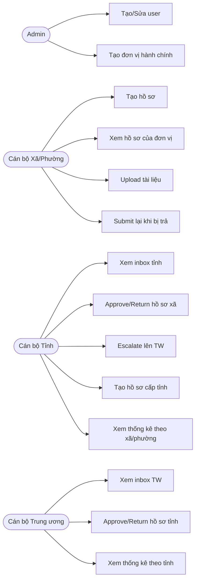

## 11 — Use cases (đồ án)

Tài liệu này mô tả Use Case theo tác nhân (actor) và các luồng chính/phụ.

---

## 11.1 Actors
- **Admin**
- **Cán bộ Xã/Phường** (`COMMUNE_OFFICER`)
- **Cán bộ Tỉnh** (`PROVINCE_OFFICER`)
- **Cán bộ Trung ương** (`CENTRAL_OFFICER`)

---

## 11.2 Use Case Diagram (Mermaid - dạng tổng quan)

> Mermaid chưa có “use-case diagram” chuẩn UML ở mọi renderer, nên dùng flowchart để thay thế.

---

## 11.3 Use cases chi tiết

### UC-01 — Đăng nhập
- **Actor**: Tất cả người dùng
- **Tiền điều kiện**: user `is_active=true`
- **Luồng chính**
  1) Nhập username/password
  2) Hệ thống xác thực và trả JWT
  3) Frontend lưu token và gọi `/me`
  4) Điều hướng vào hệ thống
- **Luồng phụ**
  - Sai mật khẩu / user bị khóa ⇒ 401
  - `must_change_password=true` ⇒ chuyển sang màn hình đổi mật khẩu

### UC-02 — Xã/Phường tạo hồ sơ
- **Actor**: Cán bộ Xã/Phường
- **Luồng chính**
  1) Nhập tiêu đề hồ sơ
  2) Tạo hồ sơ
  3) Hệ thống gán `assigned_to` sang tỉnh cha
  4) Ghi lịch sử `create`

### UC-03 — Tỉnh xử lý hồ sơ xã/phường
- **Actor**: Cán bộ Tỉnh
- **Tiền điều kiện**: hồ sơ đang `assigned_to` tỉnh
- **Luồng chính**
  1) Mở inbox tỉnh
  2) Chọn hồ sơ → chi tiết
  3) Chọn approve/return/escalate
  4) (Tuỳ chọn) ký và ghi chú
  5) Xác nhận → hệ thống cập nhật trạng thái + assigned_to + ghi lịch sử
- **Ràng buộc**
  - `return` bắt buộc có note

### UC-04 — Trung ương xử lý hồ sơ
- **Actor**: Cán bộ Trung ương
- **Tiền điều kiện**: hồ sơ đang `assigned_to` Trung ương
- **Luồng chính**
  1) Mở inbox Trung ương
  2) Approve/Return (quyết định cuối) ⇒ trả kết quả về **đúng đơn vị tạo hồ sơ** (`origin_unit`)
  3) Ghi lịch sử

### UC-05 — Upload/Download tài liệu đính kèm
- **Actor**: người có quyền xem hồ sơ
- **Luồng chính**
  1) Chọn file → upload
  2) Hệ thống lưu file và metadata
  3) Người dùng có thể tải về/mở file

