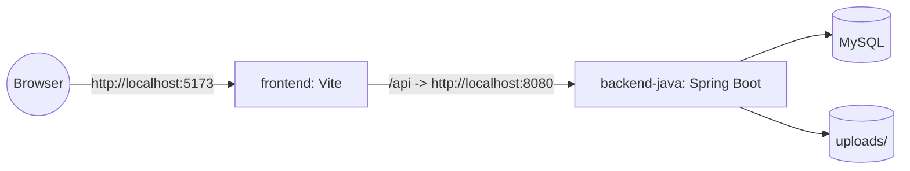

## 12 — Kiến trúc hệ thống (đồ án)

### 12.1 Kiến trúc tổng thể

Hệ thống theo mô hình client-server:

- **Frontend (React)**: UI, gọi API, điều hướng theo role
- **Backend (Spring Boot)**: xử lý nghiệp vụ, phân quyền, lưu DB, quản lý file upload
- **MySQL**: lưu dữ liệu nghiệp vụ
- **Uploads folder**: lưu file đính kèm
- **Vite**: phục vụ frontend trong dev, hiện không dùng Nginx proxy trực tiếp

---

### 12.2 Component diagram (Mermaid)

```mermaid
flowchart TB
  subgraph Browser
    UI[React UI\n(MUI components)]
  end

  subgraph FrontendDev[Frontend Dev]
    VITE[Vite\nDev server]
  end

  subgraph BackendContainer[Backend Container]
    API[Spring Boot\nREST API]
    AUTH[Auth/JWT\nRBAC + unit scope]
    SVC[Dossier/Units/Stats\nBusiness rules]
    UP[Uploads handler]
  end

  subgraph Data[Persistent Data]
    DB[(MySQL)]
    FS[(uploads/)]
  end

  UI -->|HTTP| VITE
  VITE -->|/api| API
  API --> AUTH
  API --> SVC
  API --> UP
  SVC --> DB
  AUTH --> DB
  UP --> FS
  UP --> DB
```

---

### 12.3 Deployment diagram (Mermaid)



---

### 12.4 Luồng phân quyền (tóm tắt)

- Frontend:
  - đọc `/me` để xác định `role`, `unit_id`
  - hiển thị menu theo role
- Backend:
  - kiểm tra token
  - enforce role (admin endpoints)
  - enforce workflow “đúng tuyến” bằng `assigned_to_unit_id`
