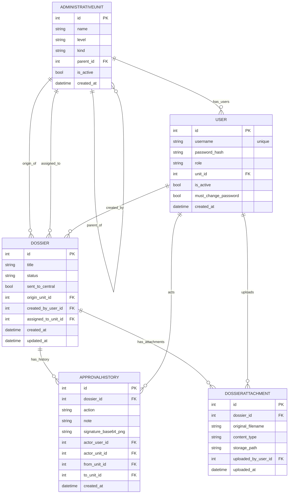
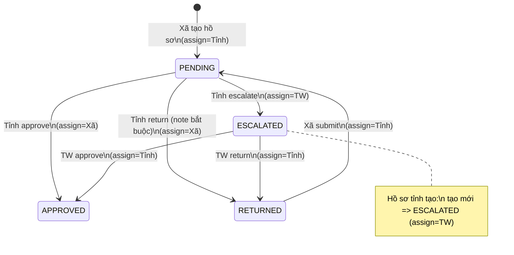
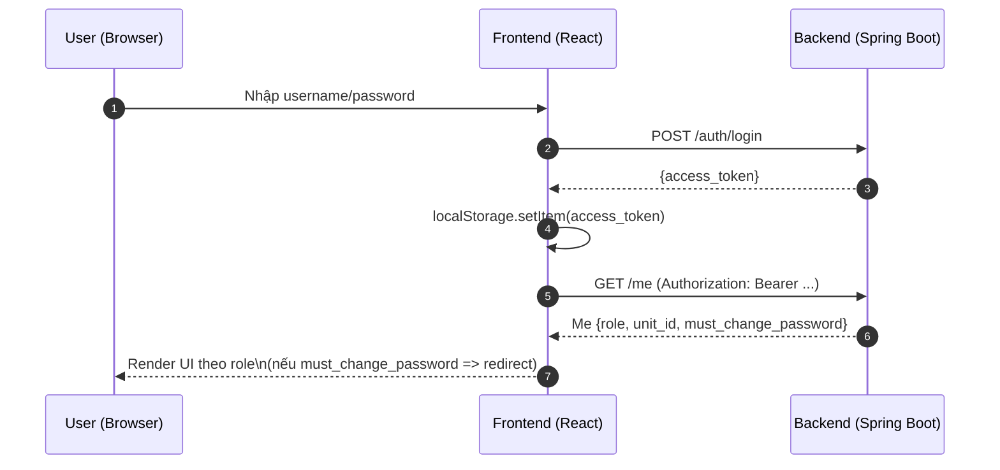
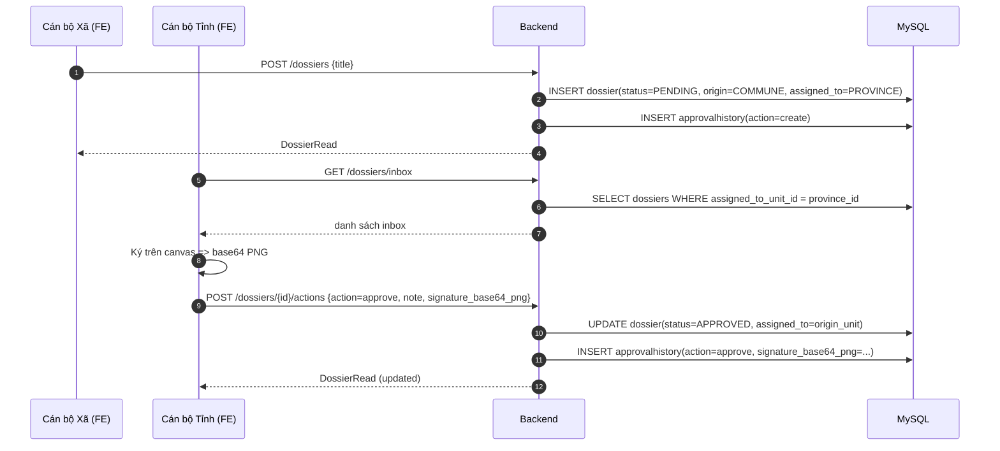
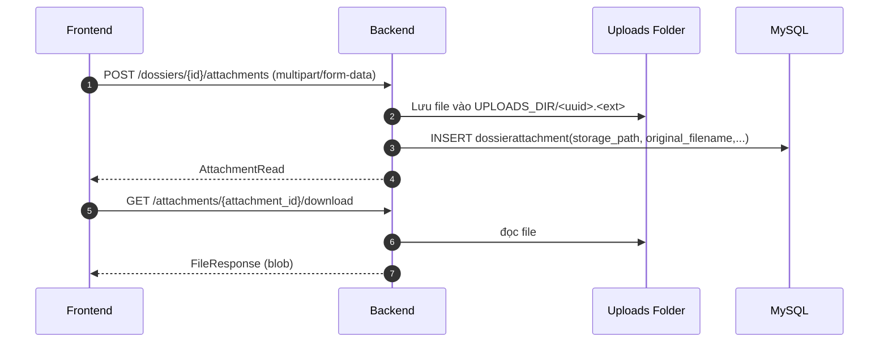

## Land Management System (MVP) — Tài liệu đặc tả (chi tiết)

Tài liệu này mô tả **thiết kế dữ liệu (database)**, **user stories**, **các chức năng**, **luồng nghiệp vụ**, **API**, **công nghệ**, và các **diagram (Mermaid)** cho hệ thống Quản lý hồ sơ đất đai theo **mô hình hành chính 3 cấp**.

> Ghi chú: Đây là MVP. Một số điểm như bảo mật JWT secret, chữ ký số đúng chuẩn, audit trail đầy đủ… được ghi ở phần “Gợi ý nâng cấp”.

---

## 1) Bối cảnh & mục tiêu

### 1.1 Mục tiêu MVP

- **Chuẩn hóa quy trình duyệt hồ sơ** theo tuyến: **Xã/Phường → Tỉnh → Trung ương → (trả kết quả)**.
- **Phân quyền** theo **vai trò (role)** và **đơn vị hành chính (unit)**.
- Cung cấp các màn hình cơ bản:
  - Đăng nhập, đổi mật khẩu
  - Inbox xử lý
  - Danh sách & chi tiết hồ sơ
  - Upload tài liệu đính kèm
  - Thống kê (chart)
  - Quản trị tài khoản (admin)

### 1.2 Mô hình hành chính 3 cấp

- **CENTRAL**: Trung ương (cấp cao nhất)
- **PROVINCE**: Tỉnh/Thành phố
- **COMMUNE**: Xã/Phường (cùng cấp COMMUNE nhưng phân biệt loại bằng `kind`)

---

## 2) Vai trò (Role) & phạm vi

### 2.1 Danh sách vai trò

- **ADMIN**
  - Quản trị tài khoản/đơn vị (MVP đang tập trung quản trị user).
  - Không tham gia duyệt hồ sơ.
- **COMMUNE_OFFICER** (cán bộ xã/phường)
  - Tạo hồ sơ cấp xã/phường.
  - Theo dõi hồ sơ do đơn vị mình tạo.
  - Khi hồ sơ bị trả về: bổ sung và **submit** lại.
- **PROVINCE_OFFICER** (cán bộ tỉnh)
  - Xử lý (approve/return/escalate) các hồ sơ từ xã/phường gửi lên (inbox tỉnh).
  - Tạo hồ sơ cấp tỉnh (gửi thẳng Trung ương).
  - Theo dõi “hồ sơ đã gửi Trung ương”.
- **CENTRAL_OFFICER** (cán bộ Trung ương)
  - Xử lý (approve/return) các hồ sơ được tỉnh gửi lên.

### 2.2 UI tự thay đổi theo vai trò (role-based UI)

Frontend có danh sách menu được lọc theo role (ví dụ “Quản trị hệ thống” chỉ hiện với `ADMIN`, “Thống kê” chỉ hiện với `CENTRAL_OFFICER/PROVINCE_OFFICER`, …). Điều này giúp:

- Giảm nhầm lẫn thao tác
- Giảm bề mặt lỗi UX (thấy chức năng nhưng bấm bị 403)

> Lưu ý: UI ẩn/hiện là UX; bảo mật thực sự vẫn do backend enforce (403).

---

## 3) Database (MySQL) — mô tả bảng & quan hệ

Backend Java dùng **MySQL** và **Spring Data JPA**. Schema được quản lý bằng **Flyway migration**.

### 3.1 Bảng `administrativeunit`

Đại diện đơn vị hành chính (có thể là Trung ương / Tỉnh / Xã-Phường).

- **id** (PK)
- **name**: tên đơn vị (VD: “Hà Nội”, “Xã …”)
- **level**: `CENTRAL | PROVINCE | COMMUNE`
- **kind** _(optional)_: dùng khi `level=COMMUNE`
  - `COMMUNE` (xã), `WARD` (phường)
- **parent_id** (FK self): cây phân cấp (CENTRAL → PROVINCE → COMMUNE)
- **is_active**
- **created_at**

### 3.2 Bảng `user`

Tài khoản đăng nhập và gắn với 1 đơn vị.

- **id** (PK)
- **username** (unique)
- **password_hash** (bcrypt)
- **role**: `ADMIN | COMMUNE_OFFICER | PROVINCE_OFFICER | CENTRAL_OFFICER`
- **unit_id** (FK → `administrativeunit.id`)
- **is_active**
- **must_change_password**: ép đổi mật khẩu sau lần login đầu (an toàn hơn seed password)
- **created_at**

### 3.3 Bảng `dossier`

Hồ sơ nghiệp vụ.

- **id** (PK)
- **title**: tiêu đề hồ sơ (MVP)
- **status**: `PENDING | APPROVED | RETURNED | ESCALATED`
- **sent_to_central**: cờ phục vụ UI “Hồ sơ gửi lên Trung ương”
- **origin_unit_id** (FK → `administrativeunit.id`): đơn vị tạo hồ sơ (xã hoặc tỉnh)
- **created_by_user_id** (FK → `user.id`)
- **assigned_to_unit_id** (FK → `administrativeunit.id`): “inbox routing” — đơn vị phải xử lý tiếp theo
- **created_at**, **updated_at**

### 3.4 Bảng `approvalhistory`

Lưu lịch sử thao tác (create/approve/return/escalate/submit).

- **id** (PK)
- **dossier_id** (FK → `dossier.id`)
- **action**: chuỗi hành động (MVP dùng string)
- **note** _(optional)_: ghi chú (ví dụ lý do trả lại)
- **signature_base64_png** _(optional)_: chữ ký dạng ảnh PNG base64 (data URL)
- **actor_user_id** (FK → `user.id`)
- **actor_unit_id** (FK → `administrativeunit.id`)
- **from_unit_id** _(optional)_: đơn vị chuyển đi (đơn vị đang assigned trước khi action)
- **to_unit_id** _(optional)_: đơn vị nhận (đơn vị assigned sau action)
- **created_at**

### 3.5 Bảng `dossierattachment`

Tài liệu đính kèm cho hồ sơ (file upload).

- **id** (PK)
- **dossier_id** (FK → `dossier.id`)
- **original_filename**
- **content_type**
- **storage_path**: đường dẫn lưu trữ tương đối trong `UPLOADS_DIR`
- **uploaded_by_user_id** (FK → `user.id`)
- **uploaded_at**

### 3.6 ERD (Mermaid)



---

## 4) User stories (theo role)

### 4.1 ADMIN (quản trị)

- **US-ADM-01**: Là admin, tôi muốn tạo tài khoản cán bộ theo đúng cấp (TW/Tỉnh/Xã) để cấp quyền truy cập đúng.
  - **AC**: Không tạo được `PROVINCE_OFFICER` cho unit không phải tỉnh; không tạo được `COMMUNE_OFFICER` cho unit không phải COMMUNE.
- **US-ADM-02**: Là admin, tôi muốn bật/tắt hoạt động của user để khóa tài khoản.
  - **AC**: User `is_active=false` không đăng nhập được (401).
- **US-ADM-03**: Là admin, tôi muốn set “must change password” để buộc user đổi mật khẩu sau khi cấp.

### 4.2 COMMUNE_OFFICER (xã/phường)

- **US-COM-01**: Tôi tạo hồ sơ mới, hệ thống tự chuyển lên tỉnh (assigned_to = tỉnh cha).
  - **AC**: Hồ sơ tạo xong có `status=PENDING`, `assigned_to_unit_id = parent(province)`.
- **US-COM-02**: Tôi xem danh sách/chi tiết các hồ sơ do xã/phường mình tạo.
- **US-COM-03**: Khi hồ sơ bị trả về, tôi bổ sung và gửi lại (submit) lên tỉnh.
  - **AC**: Chỉ hồ sơ `RETURNED` mới submit được.
- **US-COM-04**: Tôi upload tài liệu đính kèm cho hồ sơ (giấy tờ scan).

### 4.3 PROVINCE_OFFICER (tỉnh)

- **US-PRO-01**: Tôi có inbox hồ sơ cần xử lý (assigned_to = tỉnh tôi).
- **US-PRO-02**: Tôi duyệt hồ sơ xã/phường (approve) để trả kết quả về xã/phường.
- **US-PRO-03**: Tôi trả hồ sơ (return) về xã/phường và bắt buộc ghi rõ lý do.
- **US-PRO-04**: Tôi gửi lên Trung ương (escalate) khi cần cấp trên quyết định.
- **US-PRO-05**: Tôi tạo hồ sơ cấp tỉnh và gửi thẳng Trung ương.
  - **AC**: Hồ sơ do tỉnh tạo có `status=ESCALATED`, `sent_to_central=true`, `assigned_to=CENTRAL`.
- **US-PRO-06**: Tôi theo dõi các hồ sơ “đã gửi Trung ương”.
- **US-PRO-07**: Tôi xem thống kê theo xã/phường trực thuộc tỉnh.

### 4.4 CENTRAL_OFFICER (Trung ương)

- **US-CEN-01**: Tôi có inbox hồ sơ cần xử lý (assigned_to = Trung ương).
- **US-CEN-02**: Tôi duyệt (approve) hoặc trả (return) hồ sơ về tỉnh.
- **US-CEN-03**: Tôi xem thống kê toàn quốc theo tỉnh.

---

## 5) Workflow nghiệp vụ & trạng thái

### 5.1 Trạng thái chung

- **PENDING**: chờ duyệt
- **ESCALATED**: đã gửi cấp trên
- **APPROVED**: đã duyệt
- **RETURNED**: bị trả lại

### 5.2 Routing bằng `assigned_to_unit_id`

Thay vì suy luận từ trạng thái, MVP dùng `assigned_to_unit_id` để quyết định:

- Hồ sơ “đang nằm ở inbox đơn vị nào”
- Ai được phép thao tác tiếp theo

### 5.3 State/Transition diagram (Mermaid)



---

## 6) API (Backend Java Spring Boot) — danh sách endpoint

### 6.1 Auth

- `POST /auth/login` → trả JWT access_token
- `GET /me` → lấy thông tin user hiện tại
- `POST /auth/change-password` → đổi mật khẩu, set `must_change_password=false`

### 6.2 Admin

- `POST /admin/units` → tạo đơn vị (MVP)
- `POST /admin/users` → tạo user
- `GET /admin/users` → list user (filter q/role/unit_id)
- `PUT /admin/users/{id}` → cập nhật role/unit/is_active/must_change_password

### 6.3 Dossiers

- `POST /dossiers` → tạo hồ sơ (xã hoặc tỉnh)
- `GET /dossiers` → list (có filter status/unit/include_children/sent_to_central)
- `GET /dossiers/inbox` → inbox theo `assigned_to_unit_id`
- `GET /dossiers/{id}` → chi tiết hồ sơ
- `POST /dossiers/{id}/actions` → approve/return/escalate/submit (+ note + signature)

### 6.4 Attachments

- `GET /dossiers/{id}/attachments` → list file
- `POST /dossiers/{id}/attachments` → upload file (multipart)
- `GET /attachments/{attachment_id}/download` → download

### 6.5 Units

- `GET /units/provinces` → list tỉnh (Admin/Central)
- `GET /units/{province_id}/children` → list xã/phường theo tỉnh

### 6.6 Stats

- `GET /stats/provinces` → thống kê theo tỉnh (Central/Admin)
- `GET /stats/provinces/{province_id}/children` → thống kê theo xã/phường (Province hoặc Central/Admin)

### 6.7 Dev seed

- `POST /dev/seed` → seed demo nhỏ
- `POST /dev/seed-vn` → seed “giống VN”: 34 tỉnh + xã/phường + user mẫu
- `POST /dev/cleanup-legacy-seed` → xóa seed “Tỉnh A” cũ

---

## 7) Diagram (Mermaid) — Sequence

### 7.1 Login + load profile



### 7.2 Xã tạo hồ sơ → Tỉnh duyệt → (có chữ ký)



### 7.3 Upload tài liệu đính kèm



---

## 8) Frontend — màn hình & chức năng

### 8.1 Các trang chính

- `LoginPage`: đăng nhập + background + logo (asset từ `public/images`)
- `ChangePasswordPage`: buộc đổi mật khẩu nếu `must_change_password=true`
- `InboxPage`: hồ sơ cần xử lý (assigned_to = unit của user)
- `DossierListPage`: danh sách hồ sơ theo scope
- `DossierDetailPage`: xem chi tiết, upload file, thao tác approve/return/escalate/submit + ký
- `SentToCentralPage`: (tỉnh) xem các hồ sơ đã gửi TW (`sent_to_central=true`)
- `UnitsBrowserPage`: (TW/Tỉnh) tra cứu theo tỉnh/xã
- `StatisticsPage`: chart thống kê
- `AdminPage`: quản trị tài khoản

### 8.2 “Chữ ký” dùng để làm gì? Có gì hay?

Trong MVP:

- Khi thao tác duyệt/trả/gửi… ở `DossierDetailPage`, người xử lý có thể ký trực tiếp trên **canvas**.
- Frontend xuất ảnh chữ ký dạng `data:image/png;base64,...` và gửi lên backend trong `signature_base64_png`.
- Backend lưu vào `approvalhistory.signature_base64_png` như một phần audit trail.

**Giá trị thực tế**:

- Tạo “bằng chứng thao tác” trực quan cho mỗi quyết định.
- Dễ mở rộng: render vào biên bản PDF, xuất báo cáo, đối chiếu khi kiểm tra.

**Giới hạn MVP (cần biết)**:

- Đây là “chữ ký dạng hình vẽ”, chưa phải **chữ ký số** (PKI) có giá trị pháp lý.
- Base64 lưu trong DB làm DB phình nhanh; nên chuyển sang lưu file (object storage) và chỉ lưu URL + hash.

### 8.3 UI tự hiển thị theo vai trò (ví dụ)

- Menu sidebar lọc theo `me.role`.
- `DossierDetailPage` chỉ hiện nút thao tác khi:
  - hồ sơ đang assigned về đúng `me.unit_id`
  - role cho phép action tương ứng

---

## 9) Công nghệ sử dụng & lý do chọn

### 9.1 Backend

- **Spring Boot**: framework REST API, bảo mật, DI, cấu hình, startup nhanh.
- **Spring Data JPA**: ORM cho MySQL, mapping entity.
- **MySQL**: DB quan hệ production-ready.
- **JWT**: auth stateless.
- **BCrypt**: hash mật khẩu an toàn.
- **python-multipart**: upload file.

### 9.2 Frontend

- **React + Vite**: dev/build nhanh, cấu hình gọn.
- **MUI (Material UI)**: UI component chuẩn, nhanh ra màn hình.
- **Axios**: HTTP client + interceptor gắn Bearer token.
- **Chart.js + react-chartjs-2**: render thống kê.

### 9.3 Deploy

- Backend Java hiện chạy độc lập qua **Maven**.
- Frontend dev chạy bằng **Vite**.

---

## 10) Runtime — cách chạy & cấu hình

### 10.1 Chạy backend Java

```bash
cd backend-java
mvn spring-boot:run
```

- Backend: `http://localhost:8080`

### 10.2 Chạy frontend

```bash
cd frontend
npm install
npm run dev
```

- Frontend: `http://localhost:5173`

### 10.3 DB & uploads

- Backend Java dùng MySQL.
- Uploads lưu tại thư mục cấu hình trong `backend-java`.

### 10.3 Seed data

```bash
curl -X POST http://127.0.0.1:8000/dev/seed-vn
```

---

## 11) Gợi ý nâng cấp (post-MVP)

- **Bảo mật JWT**: đưa secret ra env, rotate key, refresh token.
- **Chữ ký số đúng chuẩn**: PKI, timestamp, hash tài liệu, verify chain.
- **File storage**: lưu S3/MinIO, DB chỉ lưu metadata + checksum.
- **Audit log**: chuẩn hóa `action` thành enum, log IP/user-agent, immutable audit.
- **Phân quyền chi tiết**: RBAC/ABAC, scope theo tỉnh/tuyến xử lý đầy đủ cho TW.
- **Alembic migration**: thay vì “ALTER TABLE best effort”.
